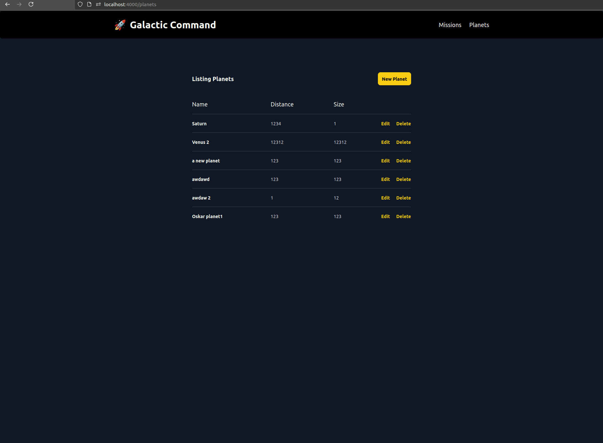
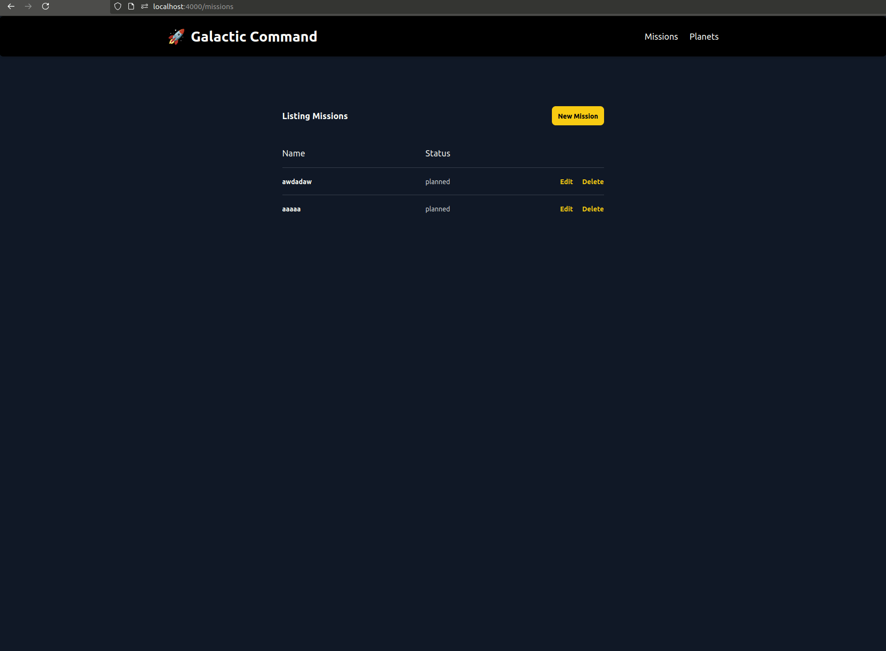
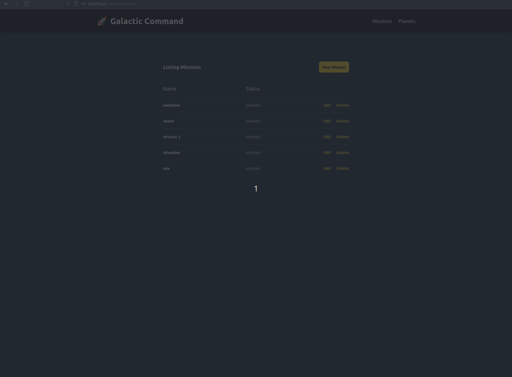

# Recycla Galactic Command
Welcome to Recyclas take home code assignment "Galactic Command"!
The intention of this project is to provide a 1 hour preparation exercise to show basic familiarty
with Elixir, Phoenix and LiveView. It will then also be the basis for discussions and follow up
questions during the technical interview. (We will not ask you to code during interview).

- Should only take around 1 hour based on our own attempts. Please try to not spend more time than this on the task. We can still have good discussions during techincal interview with incomplete code.
- Please do not hesitate to email us (hello@recycla.se) questions if something is unclear about the tasks.
- Please remember its not a test where there is a right or wrong answer.
- Please note that the before and after gifs provided are only to clearify the task and your solution does not have to have the exact same look or feel.

## How to submit
- Clone this repo (please don't fork, since other applicants can see your solutions then).
- Put repo on your own github or equivalent hosting as a private repo.
- Complete tasks.
- Make your own changes as a single Pull Request/Merge Requst so its easy to review.
- Invite `oskar@recycla.se` as a collaborator before the technical interview.

## About this project?

This is a generated Phoenix starter project slightly themed as a space mission launch dashboard.
The following commands have been used and then some slight cleanup and styling applied.
1. `mix phx.new galactic_command --database sqlite3 --no-dashboard --no-gettext --no-mailer --binary-id`
2. `mix phx.gen.live Planets Planet planets name:string distance:integer size:integer`
3. `mix phx.gen.live Missions Mission missions name:string status:string destination_id:references:planets`

You should be able to get it running by running (its using sqlite3 so no other setup should be needed).
1. `mix setup`

Try that the tests are passing
1. `mix test`

Then you can run the app with
1. `iex -S mix phx.server`
2. visit `localhost:4000`

# Tasks
### 1. Refactor `GalacticCommandWeb.PlanetLive.FormComponent` from a :live_component into "regular" `GalacticCommandWeb.PlanetLive.Form` live_view.

In phoenix 1.7 the default generator creates forms as a live_component rendered inside a modal and then used on index and show routes.
We don't like over using modals and live_components create more complexity. So we would like to refactor
`GalacticCommandWeb.PlanetLive.FormComponent` used on the routes `/planets/new` and `/planets/:planet_id/edit`
into a regular live_view called `GalacticCommandWeb.PlanetLive.Form` that handles both the `:new` and `:edit` actions and
does not use a modal or a live_component.

Before

Suggested after

### 2. Modify `GalacticCommandWeb.MissionLive.FormComponent`s destination select 

`GalacticCommandWeb.MissionLive.FormComponent` has a div with `id="destination-select"`. Inside this
div we would like to make it possible for users to choose
between existing planets OR to create a new `GalacticCommand.Planets.Planet` inside a nested form without
leaving the mission form page. It only needs to allow a single planet to be created at the moment of
saving the `Mission`.

Hint: see `inputs_for` and `cast_assoc` :)
__Please__ note that this task refers to the __Mission__ form and not the __Planet__ form as in task 1.

Before

Suggested after

